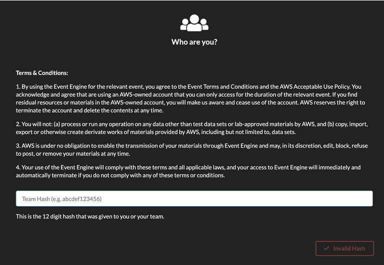
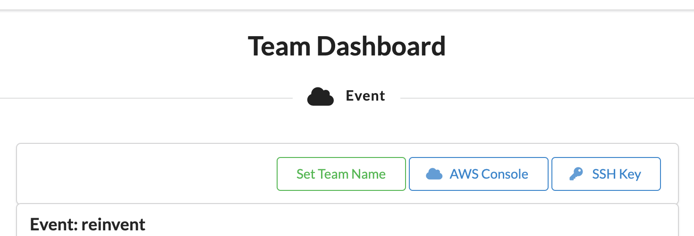
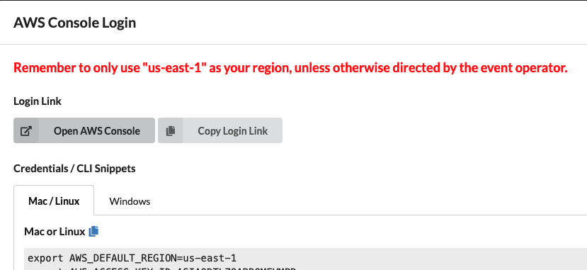
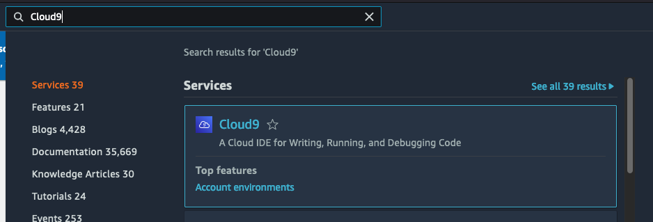
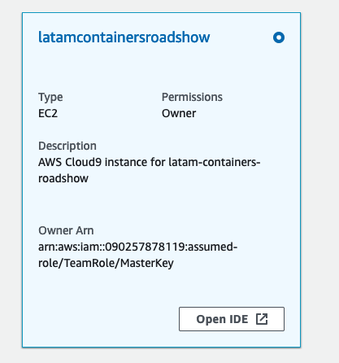
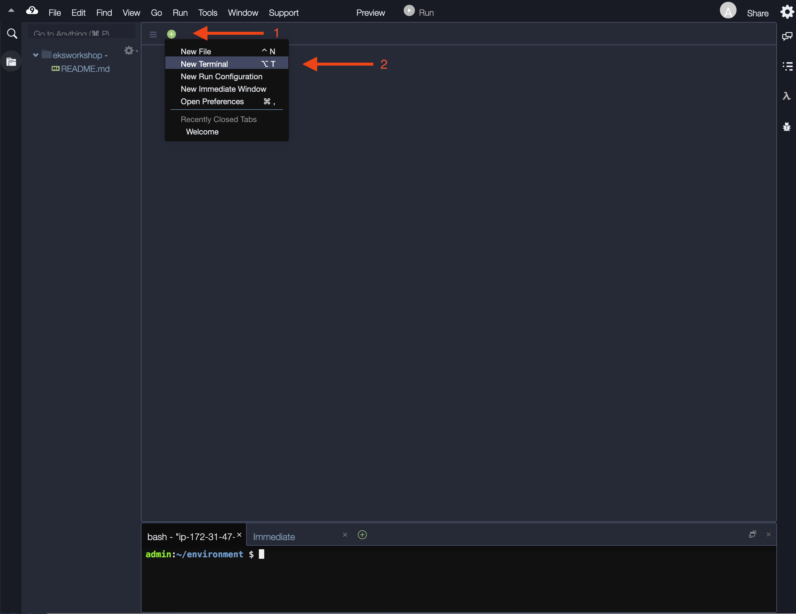

# latam-containers-roadshow

The official repository of LATAM Containers RoadShow. The AWS Containers Roadshow is an all-day external event to showcase our Container Services (EKS, ECS and ECR) for customers from Latin America, from all districts (Brazil, México and MCO). The event is a combination of presentations, customer and partner showcases, and workshops, with content from level 100 to 300.

## Getting Started

### Login to AWS Workshop Portal

This workshop creates an AWS account and a Cloud9 environment. You will need the **Event Hash** provided upon entry, and your email address to track your unique session.

Connect to the portal by clicking the button or browsing to https://dashboard.eventengine.run/. The following screen shows up.

 

Enter the provided hash in the text box. The button on the bottom right corner changes to **Accept Terms & Login.** Click on that button to continue.

 

Click on AWS Console on dashboard.

 

Take the defaults and click on Open AWS Console. This will open AWS Console in a new browser tab.

### Opening AWS Cloud9

AWS Cloud9 is a cloud-based integrated development environment (IDE) that lets you write, run, and debug your code with just a browser. It includes a code editor, debugger, and terminal.

In your account you will see a Cloud9 instance already deployed with all permissions that you need to complete de workshop.

1. Open the Cloud9 Instance, go to the search box and search for `Cloud9`, click on it:

 

2. Click on `Open IDE` in your Cloud9 instance:

 

3. When it comes up, customize the environment by:

Closing the Welcome tab

 

4. Opening a new terminal tab in the main work area:

 

### Select the workshop

Once you have completed above steps, you can head straight to:

- [Amazon Elastic Container Service (ECS)](./ecs/)
- [Amazon Elastic Kubernetes Service (EKS)](./eks/)

Enjoy the workshops!

## Security

See [CONTRIBUTING](CONTRIBUTING.md#security-issue-notifications) for more information.

## License

This library is licensed under the MIT-0 License. See the LICENSE file.

