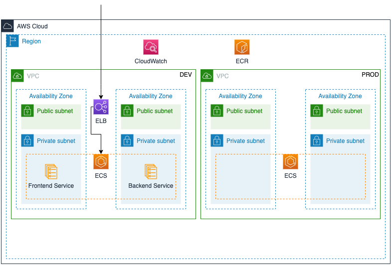
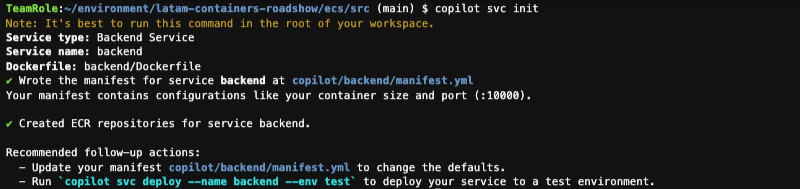
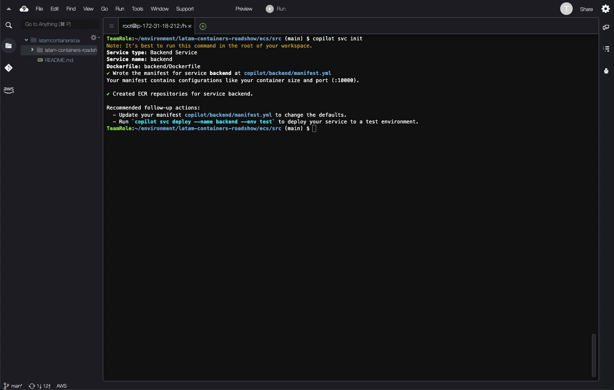
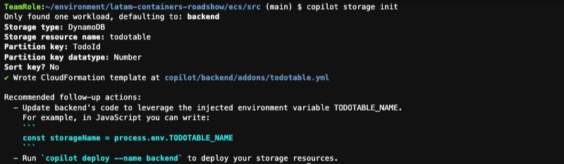
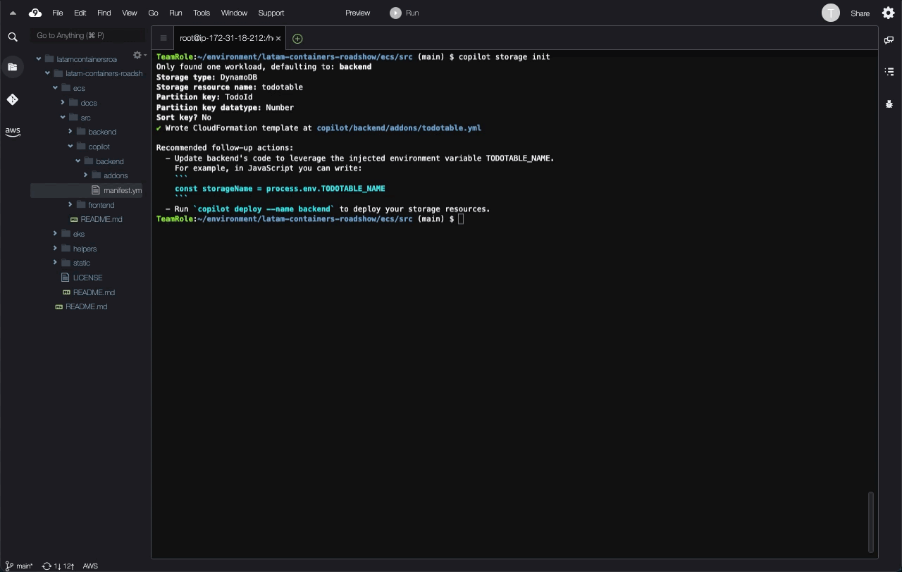
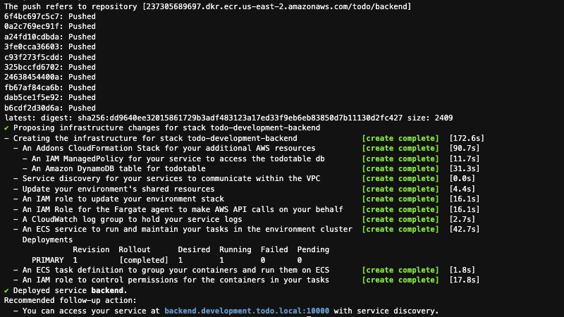
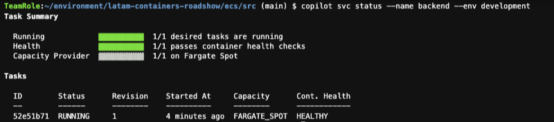
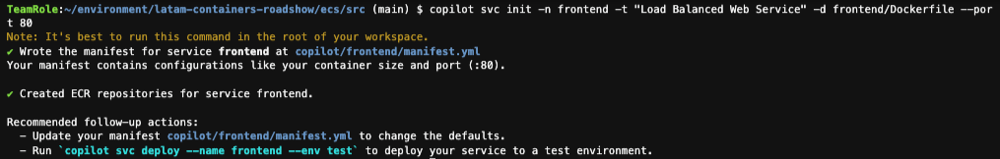
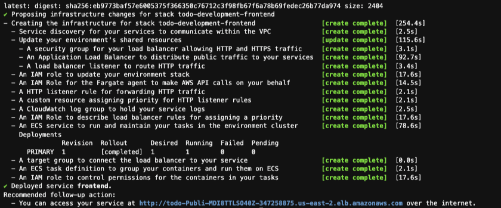
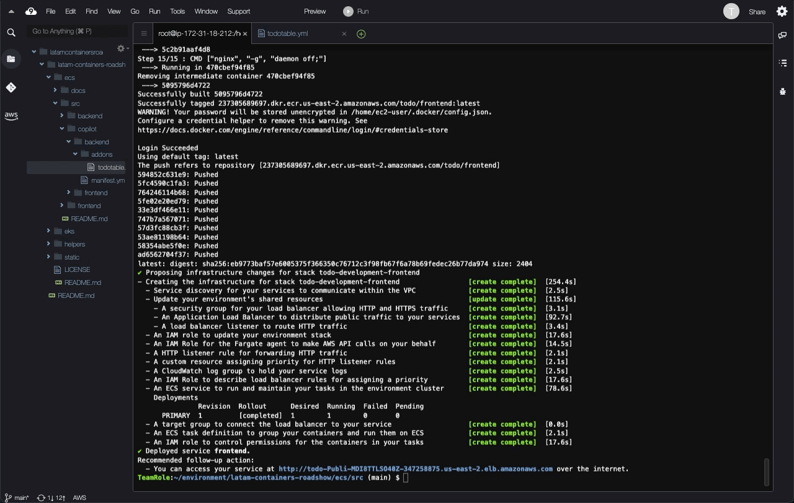

# LATAM Containers Roadshow - Workshop de Amazon ECS

[**< Voltar**](./2-Build.md)

## Capítulo 3 - Implantando a Aplicação

Dado que já temos nossos ambientes de infraestrutura no ar, vamos agora implantar os componentes da nossa aplicação `todo`. Essa aplicação é composta por dois componentes, `backend` e `frontend`. Os códigos fonte desses componentes estão disponíveis em `ecs/src`, e possuem seus respectivos `Dockerfiles` já construídos e armazenados nos mesmos diretórios.

Assim como fizemos no capítulo anterior, vamos continuar explorando o AWS Copilot mas agora na implantação dos nossos Serviços (`Services`) no AWS Copilot, que representam nossas cargas de trabalho em execução. Estes podem ser de vários tipos (Request-Driven Web Service, Load Balanced Web Service, Backend Service ou Worker Service), e podem dependener de serviços complementares, como armazenamento ou banco de dados, que chamamos de de `Add-Ons`.

O nosso laboratório no final desse capítulo será como o diagrama a seguir:



1. Vamos começar configurando o nosso serviço para o componente de backend, que vai ser do tipo `Backend Service`, e vai ser criado a partir do Dockerfile disponível em `backend/Dockefile`. Vamos usar o comando interativo:

```bash
copilot svc init
```

Nas perguntas, respoda:

 - Which service type best represents your service's architecture? **Backend Service**
 - What do you want to name this service? **backend**
 - Which Dockerfile would you like to use for backend? **backend/Dockerfile**



2. Vamos explorar o arquivo criado em `src/copilot/backend/manifest.yml`, olhar as opções de configuração que temos disponível, usando o editor de arquivos do AWS Cloud9. Vamos modificar esse arquivo para adicionar uma configuração de validação de saúde (health-check) e dizer que gostaríamos de usar capacidade Spot para reduzir o nosso custo do ambiente não produtivo:



Inserir este trecho logo depois de `port: 10000`:

```yaml
  healthcheck:
    command: ["CMD-SHELL", "curl -f http://localhost:10000/ishealthy || exit 1"]
    interval: 10s
    retries: 2
    timeout: 6s 
    start_period: 10s
```

E este trecho depois do `memory: 512`:

```yaml
count:
  spot: 1
```

3. Esse componente de backend precisa de uma banco de dados do Amazon DynamoDB para desempenhar sua função (ou seja, a aplicação já está preparada para consumir esse serviço). Vamos usar do AWS Copilot para configurar esse serviço adicional de forma integrada. Para isso, vamos executar:

```bash
copilot storage init
```

Nas perguntas, responda:

 - What type of storage would you like to associate with backend? **DynamoDB**
 - What would you like to name this DynamoDB Table? **todotable**
 - What would you like to name the partition key of this DynamoDB? **TodoId**
 - What datatype is this key? **Number**
 - Would you like to add a sort key to this table? **N**



4. Esse comando gerou um diretório em `src/copilot/backend/addons`, e um AWS CloudFormation stack chamado `todotable.yaml` que define o banco de dados DynamoDB que criamos. Atualmente o AWS Copilot suporta Amazon S3 (objetos), Amazon DynamoDB (NoSQL) e Amazon Aurora (SQL) como add-ons, mas você pode criar seus próprios stacks e adicionar à essa estrutura para que o AWS Copilot coordene sua implantação.



5. Em seguida, podemos de fato realizar a implantação do nosso componente `backend` como um serviço no ambiente de desenvolvimento. Esse processo vai gerar a imagem de container do nosso componente, enviar para o Amazon Elastic Container Registry (ECR), e depois provisionar os recursos necessários para operacionalizar o componente no Amazon ECS. Para isso, vamos executar:

```bash
copilot svc deploy
```

Na pergunta, responda:

 - Select an environment: **development**



6. Podemos usar o AWS Copilot para interagir com o serviço e validar o estado atual:

```bash
copilot svc status --name backend --env development
```



7. Agora vamos configurar o nosso componente de `frontend`, que será do tipo `Load Balanced Web Service`. Dessa vez vamos usar o comando completo ao invés do modo interativo:

```bash
copilot svc init -n frontend -t "Load Balanced Web Service" -d frontend/Dockerfile --port 80
```



8. E vamos implantá-lo também no nosso ambiente de desenvolvimento:

```bash
copilot svc deploy --app todo --env development --name frontend
```



9. Diferente do serviço do tipo `Backend Service`, que não gera nenhum Elastic Load Balancer (ELB) para acesso externo, o serviço do tipo `Load Balanced Web Service` cria um Application Load Balancer (ALB) público. Podemos testar nossa aplicação `todo` no ambiente de desenvolvimento!



[**Próximo >**](./4-Observe.md)