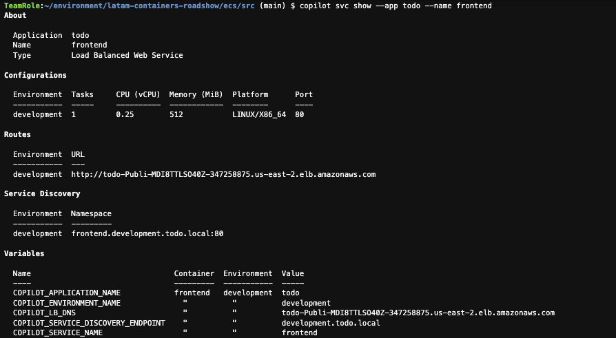
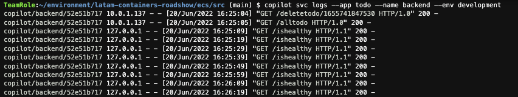
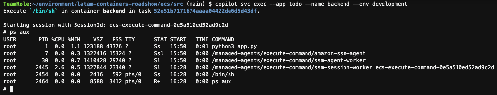
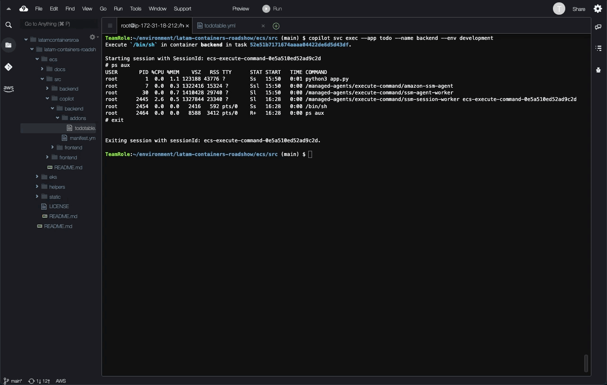
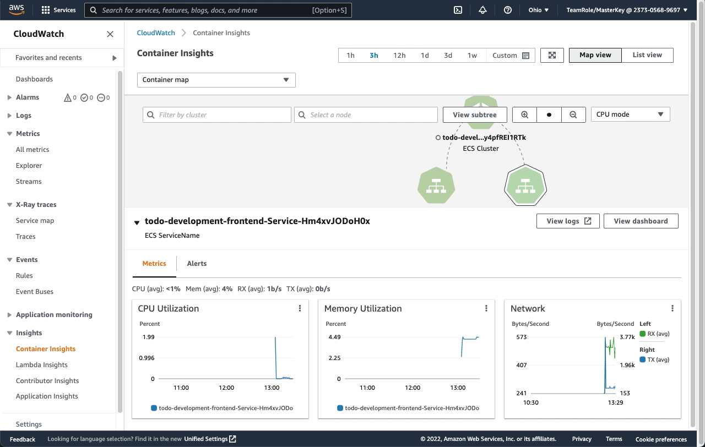

# LATAM Containers Roadshow - Workshop de Amazon ECS

[**< Voltar**](./3-Deploy.md)

## Capítulo 4 - Observando o Ambiente

Finalmente implantamos a nossa aplicação `todo`, composta pelos componentes `frontend` e `backend`, como containers rodando dentro do Amazon Elastic Compute Service (ECS) e usando o AWS Fargate como camada computacional serverless.

Mas dado que praticamente estamos trabalhando em um nível de abstração alto, como fica o nosso dia a dia operacional?

1. Com o AWS Copilot conseguimos gerenciar as nossas cargas de trabalho de forma bem simples. Vamos obter detalhes de como nossos serviços estão funcionando:

```bash
copilot svc show --app todo --name frontend
```



2. Também conseguimos obter os logs dos nossos serviços:

```bash
copilot svc logs --app todo --name backend --env development
```



2. Podemos acessar o container em execução dentro do ambiente Amazon ECS, mesmo usando AWS Fargate como motor de execução dos containers. Essa capacidade usa uma integração com o AWS Systems Manager Session Manager, e requer a instalação de uma extensão ao AWS CLIv2 no nosso ambiente de trabalho. Esse tipo de acesso pode ser importante para eventuais resoluções de problemas:

```bash
copilot svc exec --app todo --name backend --env development
```



3. Além da possibilidade de interagir com o nosso ambiente e aplicação através do AWS Copilot, no capítulo 2 criamos os ambientes já integrados ao Amazon CloudWatch a partir de uma funcionalidade chamada Container Insights (opção `--container-insights`). Essa integração permite ter métricas e logs desses ambientes disponíveis no Amazon CloudWatch para visualização e análise. Vamos dar uma olhada acessando a console do Amazon CloudWatch, e acessando a opção Container Insights no menu lateral esquerdo:



4. Ainda nessa tela podemos ver de forma alto nível as métricas do nosso ambiente Amazon ECS e dos nossos componentes `backend` e `frontend`. Além disso, podemos também expandir essa visão e navegar pelas métricas e nas visualizações disponíveis nativamente:



5. Além de métricas agregadas, temos disponíveis os logs dos nossos componentes da aplicação `todo` disponíveis de forma centralizada. Ainda no Amazon CloudWatch, vamos agora na opção Logs Insights no menu lateral esquerdo:


Legal, né? Com o mínimo de esforço conseguimos operacionalizar nossa aplicação `todo` na nuvem, usando containers de forma escalável e sustentável. Mas ainda estamos no ambiente de desenvolvimento... vamos pensar na virada pro ambiente de produção?

[**Próximo >**](./5-Automate.md)