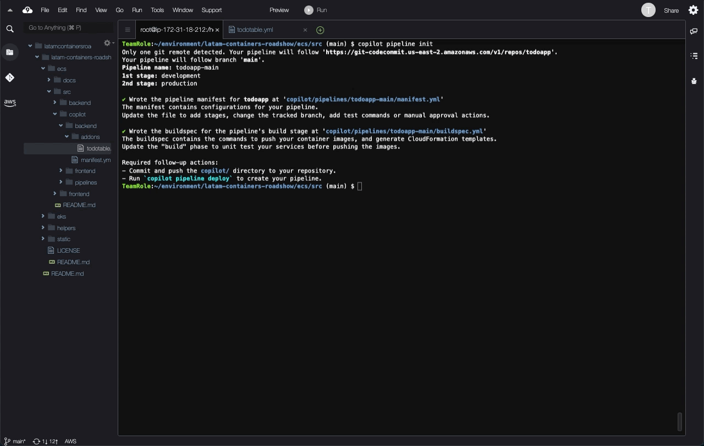

# LATAM Containers Roadshow - Workshop de Amazon ECS

[**< Voltar**](./4-Explore.md)

## Capítulo 5 - Automatizando a Esteira

Nos capítulos anteriores aprendemos como usar o AWS Copilot para implantar e operacionalizar aplicações baseadas em containeres no Amazon Elastic Container Service (ECS). Vimos também como manter a obersabilidade do nosso ambiente através do Amazon CloudWatch. Entretanto estamos ainda trabalhando exclusivamente no nosso ambiente de desenvolvimento.

Nesse capítulo vamos explorar como podemos implantar uma esteira de entrega contínua (Continuous Delivery), ou até implantação contínua (Continuous Deployment), mantendo a simplicidade operacional que vimos nos capítulos anteriores. Essa esteira vai ajudar a automatizar a entrega de mudanças no nosso ambiente de desenvolvimento e também no de produção.

O nosso laboratório no final desse capítulo será como o diagrama a seguir:


1. No laboratório vamos seguir uma estrutura de monorepo, onde todos os componentes da aplicação (frontend e backend) são versionados no mesmo repositório de código, usando o AWS CodeCommit. Para isso, vamos criar nosso repositório:

```bash
aws codecommit create-repository --repository-name todoapp --repository-description "Workshop ECS"
```


2. Antes da gente usar esse repositório, vamos configurar o nosso cliente Git para se autenticar usando a integração nativa com o AWS Identity and Access Management (IAM). Também vamos aproveitar para configurar nossas informações como `name` e `email` e a branch padrão como `main`:

```bash
git config --global credential.helper '!aws codecommit credential-helper $@'
git config --global credential.UseHttpPath true
git config --global user.name "Fulano de Tal"
git config --global user.email fulanodetal@exemplo.br
git config --global init.defaultBranch main
```

2. Vamos agora inicializar o nosso repositório local dentro do diretório (`src/`) e adicionar o nosso repositório do AWS CodeCommit como o `origin`. Esse vai ser o repositório que a nossa esteira vai ser integrada.

```bash
export AWS_REGION=$(curl -s http://169.254.169.254/latest/dynamic/instance-identity/document | jq .region -r)
cd ~/environment/latam-containers-roadshow/ecs/src/
git init
git remote add origin https://git-codecommit.$AWS_REGION.amazonaws.com/v1/repos/todoapp
git add -A
git commit -m 'feat: initial code version'
```

3. Vamos agora usar o AWS Copilot para inicializar a configuração da nossa esteira, assim como fizemos para os outros recursos dos capítulos anteriores. Para isso, vamos usar o nome `todoapp-main` (como uma referência à branch `main`) e vamos selecionar os ambientes `development` e `production` como primeiro e segundo estágio, respectivamente:

```bash
copilot pipeline init
```


4. Por padrão, o pipeline vai ser criado com promoção automática entre os ambientes de desenvolvimento e produção. Normalmente teríamos etapas de testes automatizados para validar essa promoção automática, mas nossa aplicação é muito simples. Portanto, vamos sinalizar que gostaríamos de ter uma aprovação manual entre ambientes. Para isso, vamos modificar o manifesto de configuração do pipeline `src/copilot/pipelines/todoapp-main/manifest.yml`:



5. Vamos fazer o "commit" das novas configurações, enviar essas configurações pro repositório do AWS CodeCommit:

```bash
git status
git add -A
git commit -m 'feat: add pipeline'
git push origin main
```


6. Na sequência, vamos implantar o nosso pipeline através do AWS CodePipeline:

```bash
copilot pipeline deploy
```


7. Podemos agora olhar como a nossa esteira foi construído no AWS CodePipeline através da console. Para isso vamos usar novamente a maravilhosa barra de busca:


8. Como você poder notar, o processo de criação da esteira dispara uma primeira execução de forma automática. Como estamos usando uma estrutura de monorepo, a esteira fará a automação para ambos os componentes de `frontend` e `backend` como etapas paralelas dentro dos estágios.


9. A nossa esteira ficará em suspensão esperando aprovação antes de executar mudança no ambiente produtivo, esperando a aprovação manual que configuramos. Vamos para produção!


10. O processo de implantação em produção vai demorar um pouco mais porque a esteira vai ter que implantar a parte da infraestrutura dos serviços (que fizemos manualmente nos capítulos anteriores para o ambiente de desenvolvimento). Ao final, podemos ver as mudanças usando o AWS Copilot:

```
copilot svc show --app todo --name frontend
copilot svc show --app todo --name backend
```


11. A partir desse momento, qualquer mudança no nosso repositório vai gerar um novo evento de execução no nosso pipeline e, consequentemente, uma mudança no nosso ambiente de desenvolvimento e, se aprovado, em produção. Vamos exercitar essa dinâmica alterando o arquivo `src/frontend/webapp/public/index.html` do frontend!

```html
  <title>React Todo App - v2</title>
```


12. Depois de modificar o arquivo, vamos executar o 'commit' com a mudança e enviar para o repositório:

```bash
git status
git add frontend/webapp/public/index.html
git commit -m 'fix: changing title'
git push origin main
```


13. Além de acompanhar a execução da esteira pela console, como fizemos em etapas anteriores, podemos acompanhar também pelo AWS Copilot:

```bash
copilot pipeline status
```


14. A nossa esteira permanecerá no estado de `InProgress` para o estágio de `DeployTo-production` enquanto não aprovarmos a promoção. Mas podemos acessar a URL do ambiente de desenvolvimento para validar a mudança.

```bash
copilot svc show --app todo --name frontend
```


A mudança introduzida foi pequena, mas suficiente para demonstrarmos a capacidade da esteira que construímos. A partir daqui você pode explorar o AWS Copilot e suas capacidades por conta própria! A documentação do AWS Copilot está disponível em https://aws.github.io/copilot-cli/docs/overview/.

Caso você queira limpar sua conta, o próximo capítulo explica como apagar o que foi criado.

[**Próximo >**](./6-Cleanup.md)