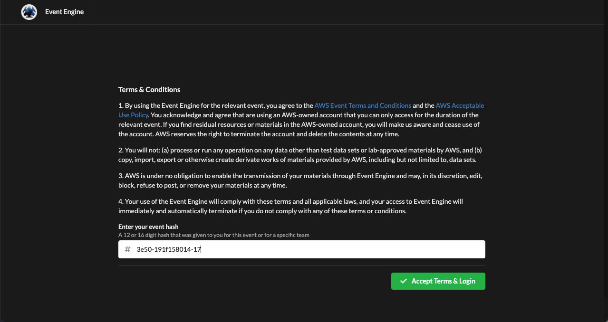
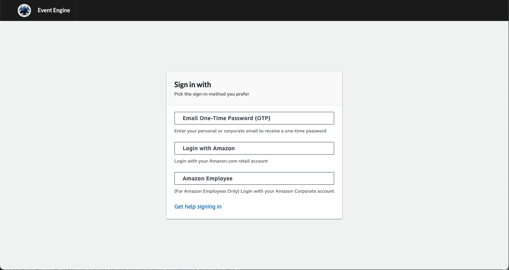
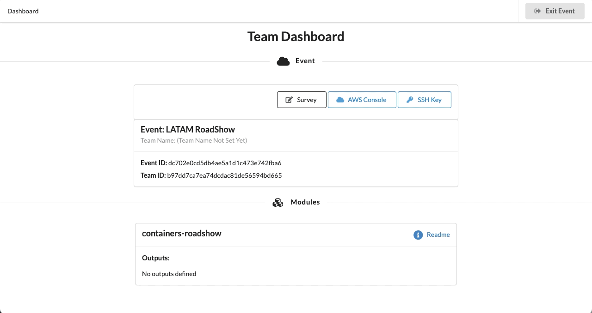
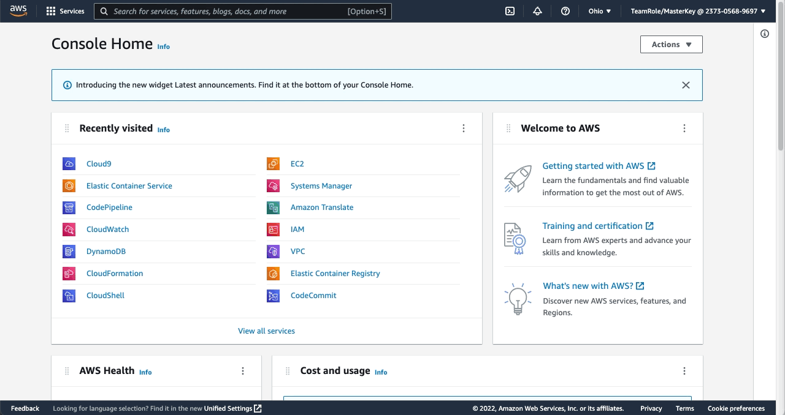

# LATAM Container Roadshow - Workshops

## Acesso ao Ambiente de Laboratório

Este workshop cria uma conta da AWS e um ambiente Cloud9. Você precisará do **Event Hash** fornecido durante o evento. Esse código é de uso exclusivo e individual para ter acesso ao ambiente de laboratório. Para usá-lo, siga os passos a abaixo:

1. Conecte-se ao portal de laboratórios através do link https://dashboard.eventengine.run/. Insira o hash fornecido durante o evento na caixa de texto. O botão no canto inferior direito muda para  **Accept Terms & Login**. Clique nesse botão para continuar.

2. Efetue seu login usando seu email corporativo com a opção **E-mail One Time Password (OTP)**.

3. Depois de efetuar o login, clique em **AWS Console** e depois em **Open Console** para acessar o painel da conta de laboratório.

4. Depois, vamos acessar o ambiente existente do AWS Cloud9 disponível na nossa conta. Ele servirá como base para execução de todas as etapas dos workshops direto do seu navegador.

## Escolhendo o Workshop

A partir deste momento você poderá optar por executar os seguintes workshops:

- [Amazon Elastic Container Service (ECS)](./ecs/docs/pt_BR/README.md)
- [Amazon Elastic Kubernetes Service (EKS)](./eks/docs/pt_BR/README.md)