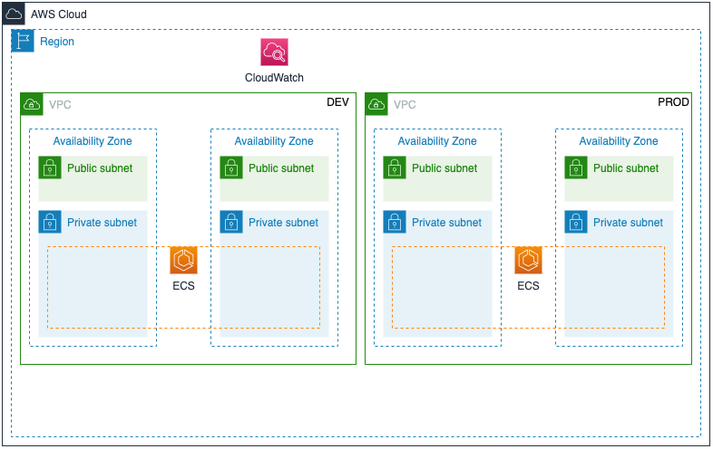

# LATAM Containers Roadshow - Workshop de Amazon ECS

[**< Voltar**](./1-Prepare.md)

## Capítulo 2 - Construindo a Infraestrutura

Agora que temos tudo o que precisamos em nosso ambiente de trabalho, neste capítulo vamos construir a infraestrutura que hospedará nossa aplicação em containers. Este workshop explorará como aproveitar o Amazon Elastic Compute Service (ECS) para operar containers em escala, aproveitando o vasto ecossistema de serviços AWS, sem comprometer a simplicidade operacional do ambiente.

Existem várias maneiras de provisionar infraestrutura na AWS como, por exemplo, através do AWS CloudFormation, do AWS Cloud Development Kit (CDK) ou do Hashicorp Terraform. Entretanto, neste workshop vamos usar o AWS Copilot, que é uma ferramenta de linha de comando que busca simplificar a criação e operação de aplicações conteinerizadas na AWS, e possui um foco nas pessoas desenvolvedoras que não necessariamente conhecem em profundidade as boas práticas para implantação de infraestrutura de containers na nuvem AWS.

O nosso laboratório no final desse capítulo ficará como o diagrama a seguir.



1. Vamos inicialmente clonar o repositório base do workshop, onde se encontram os códigos-fonte dos componenets da nossa aplicação de exemplo (`todo`). Vamos usar essa estrutura de diretórios também como espaço para inicialização do AWS Copilot.

```bash
cd ~/environment/
git clone https://github.com/aws-samples/latam-containers-roadshow.git
cd latam-containers-roadshow/ecs/src/
```

2. AWS Copilot é uma ferramenta de linha de comando, e já se encontra instalado e disponível no nosso ambiente de trabalho do AWS Cloud9. Vamos explorar quais são as opções disponíveis, através do comando a seguir.

```bash
copilot help
```


3. Vamos seguir e inicializar nossa aplicação do AWS Copilot com o nome de `todo`. Uma aplicação para o AWS Copilot representa uma descrição alto nível da aplicação que estamos tentando construir, e é uma coleção de Serviços (`Services`) e Ambientes (`Environments`).

```bash
copilot app init todo
```


4. Para que o AWS Copilot consiga gerenciar as aplicações, o último comando criou construções no AWS Identity and Access Management (IAM) e no AWS System Manager (SSM) Parameter Store através do AWS CloudFormation. Podemos listar as aplicações com:

```bash
copilot app ls
```


5. Além disso, ele criou uma estrutura de diretórios e arquivos onde o comando de inicialização foi executado, para armazenar os arquivos de configuração dos componentes relacionados ao AWS Copilot. Esse diretório ainda está praticamente vazio, mas ele vai ficar mais cheio em breve!

```bash
tree -a .
```


6. Uma vez que a nossa aplicação foi criada pelo AWS Copilot, vamos criar os ambientes (`Environments`). Estes representam as infraestruturas que suportarão os componentes da nossa aplicação e, que no nosso caso, serão baseada em Amazon Elastic Container Service (ECS). Estamos usando a opção `--container-insights` para sinalizar que queremos a ativar a integração com Amazon CloudWatch, o nosso serviço nativo e administrado de observabilidade (logs, métricas, alertas e dashboards). Vamos primeiro criar o nosso ambiente de desenvolvimento:

```bash
copilot env init --app todo --name development --container-insights
```

Use as seguintes respostas:
- Which credentials would you like to use to create development? **[profile default]**
- Would you like to use the default configuration for a new environment? **Yes, use default.**


7. Ao criar o nosso ambiente o AWS Copilot voltou a provisionar recursos através do AWS CloudFormation, dentre eles uma Virtual Private Cloud (VPC), Subnets e nosso cluster de Amazon ECS. Não foram criadas instâncias de Amazon EC2 pois o AWS Copilot usa o AWS Fargate como motor de execução serverless para os nossos containers.


8. Vamos repetir o processo para criar nosso futuro ambiente produtivo. Poderíamos usar contas AWS diferentes, mas por uma questão de simplificação vamos ter ambos ambientes na mesma conta, porém em Virtual Private Clouds (VPCs) independentes. Dessa vez vamos usar a opção `--default-config` para ele seguir com a opção de infraestrutura padrão, a opção `--prod` para sinalizar que esse será um ambiente de produção e a opção `--profile default` para usar o perfíl padrão do AWS CLI v2.

```bash
copilot env init --app todo --name production --container-insights --default-config --prod --profile default
```


9. Uma vez criado os ambientes de desenvolvimento e produção, vamos olhar como ficou a definição até o momento da nossa aplicação no AWS Copilot. Na saída do comando vemos um resumo alto nível, e quais são os ambientes envolvidos que pertecem à essa aplicação. Perceba que ele deixa claro qual o AWS Account ID e AWS Region estão sendo usados, pois a ferramenta é compatível com arquiteturas multi-regiões e/ou multi-contas!

```bash
copilot app show -n todo
```


Está tudo pronto pra implantarmos os componentes da nossa aplicação `todo`!

[**Próximo >**](./3-Deploy.md)